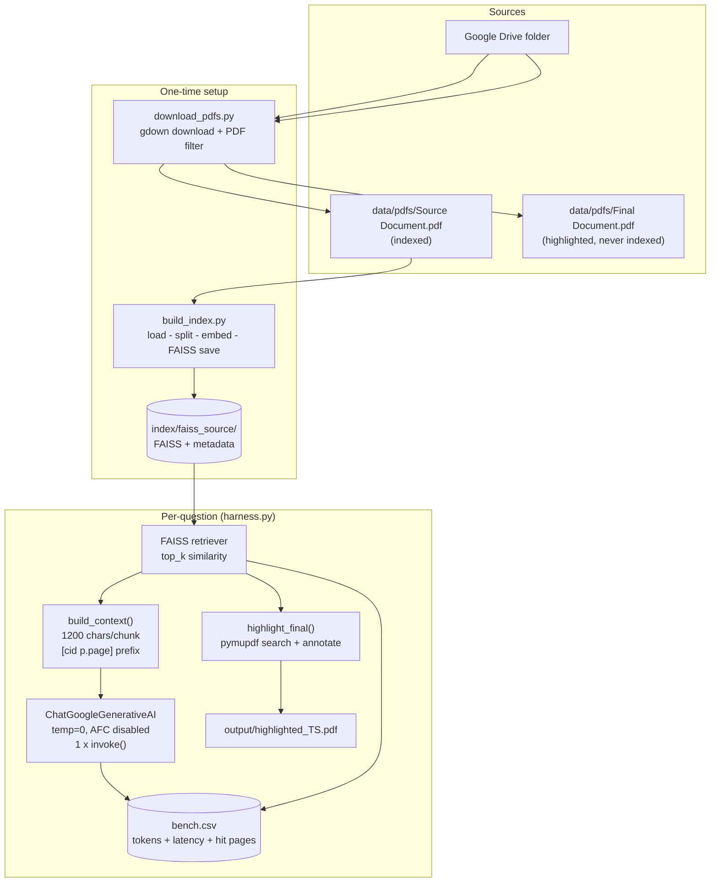
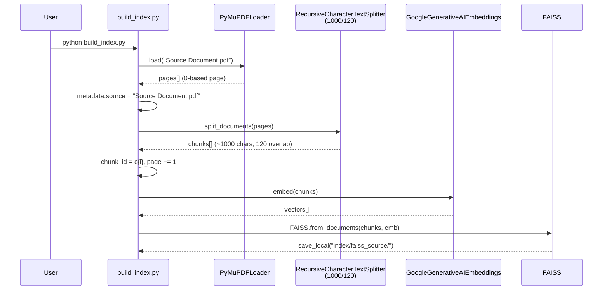
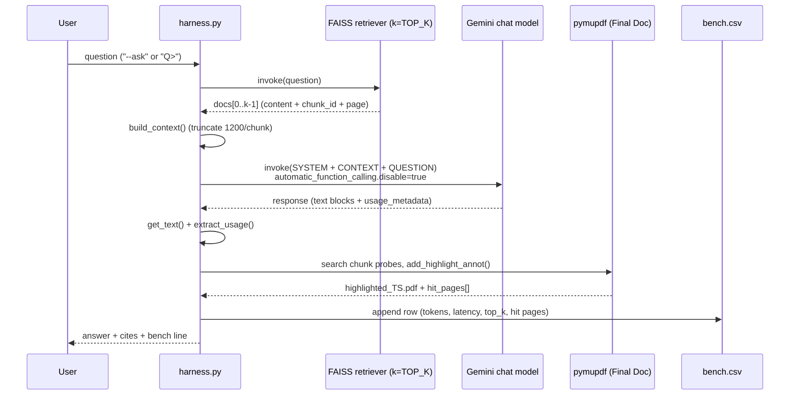
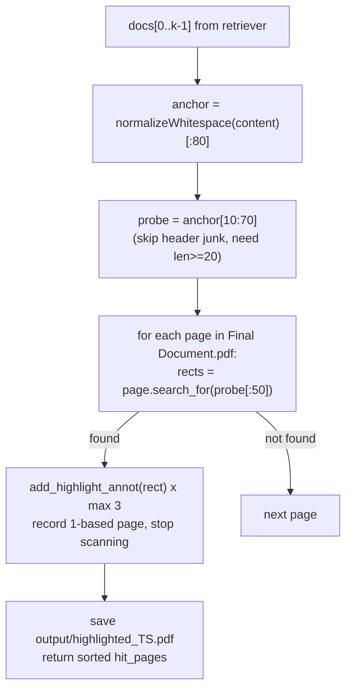

# Architecture, Flow & Logic (in detail)

Small grounded RAG: exactly **1 LLM call per question**, answers come **only from retrieved PDF chunks**, every run is benchmarked and visually grounded with highlights.

## 1. System architecture



Key separation: `Source Document.pdf` is the **knowledge base** (embedded). `Final Document.pdf` is the **evidence surface** (highlighted, never retrieved from). The FAISS index stores vectors + `chunk_id` (`c0, c1, ...`) + 1-based `page` for citations like `[c10 p.4]`.

Repo map:

| Path | Role |
|---|---|
| `download_pdfs.py` | Drive -> `data/pdfs/`, temp `data/_raw_drive/` (deleted unless `--keep-raw`) |
| `build_index.py` | `Source Document.pdf` -> `index/faiss_source/` (run once, re-run on source/model change) |
| `harness.py` | interactive / `--ask` loop, 1 LLM call + bench + highlight |
| `list_models.py` | lists Gemini models + input/output token limits |
| `.env` | `GOOGLE_API_KEY, GEMINI_MODEL, GEMINI_EMBED_MODEL, TOP_K, MAX_OUTPUT_TOKENS, THINKING_BUDGET` |
| `bench.csv` | append-only benchmark log, one row per turn |
| `output/` | `highlighted_<YYYYMMDD_HHMMSS>.pdf` per question (unless `--no-highlight`) |

Config defaults (`harness.py:55-66`, `.env` overrides): `MODEL=gemini-2.5-flash`, `TOP_K=3`, `MAX_OUT=2048`, `THINKING_BUDGET=200`. Thinking tokens share the `max_output_tokens` budget — a big thinking budget + small max-out truncates the answer (`finish_reason=MAX_TOKENS`).

## 2. Indexing flow (`build_index.py`)



Logic notes:

* Splitter separators: `["\n\n", "\n", ". ", " ", ""]` — keeps paragraphs/sentences intact (`build_index.py:54-57`).
* Overlap 120 chars preserves cross-boundary facts (dates, names).
* `chunk_id` is the citation key; page is made 1-based to match PDF readers.
* Embedding model must match at query time (`EMBED_MODEL` in both files reads the same `.env` key). Changing it requires rebuilding the index.

## 3. Query flow (`harness.py ask_once`, 1 LLM call)



Prompt contract (`harness.py:60-66,187`):

```text
{SYSTEM}
CONTEXT:
[c10 p.4] <chunk text up to 1200 chars>
[c22 p.8] <...>

QUESTION: <user question>
ANSWER:
```

`SYSTEM` rules: answer **only** from context (else exactly `NOT FOUND IN SOURCE`), 4–10 sentences in 2–3 paragraphs, **every factual sentence ends with `[cid p.page]`**, no outside knowledge.

Generation details:

* `temperature=0` — deterministic, grounded answers.
* `automatic_function_calling={"disable": true}` — no tools are used; this silences the `google-genai` warning `Direct use of AFC in Models.generate_content...` (`harness.py:193-197`). A logging filter on `google_genai.models` is belt-and-braces.
* `get_text()` (`harness.py`) joins only `type=text` blocks — newer `langchain-google-genai` returns a block list with thought signatures, not a plain string. Without this the answer prints as a one-line Python repr.
* Truncation guard: if `finish_reason == MAX_TOKENS`, a `[WARN: answer cut off...]` hint is appended — raise `MAX_OUTPUT_TOKENS` or lower `THINKING_BUDGET`.

## 4. Highlight logic (`highlight_final`)



* A copy of `Final Document.pdf` is annotated (`pymupdf.open`, never `fitz` — the `fitz` alias is deprecated).
* Only the first matching page per chunk is highlighted to avoid spraying.
* `hit_pages=[]` in `bench.csv` means the probe text wasn't found verbatim (paraphrase/OCR drift) — citations in the answer are still the source of truth.

## 5. Benchmarking (`log_bench` -> `bench.csv`)

One row per turn, columns: `ts, model, question, input_tokens, output_tokens, thinking_tokens, total_tokens, latency_s, top_k, highlight_pdf, hit_pages`.

* `latency_s` = `perf_counter()` around the single `invoke()` — pure model time, retrieval/highlight excluded.
* `output_tokens` **includes** thinking on Gemini — answer budget ≈ `output - thinking`. If `output ≈ MAX_OUTPUT_TOKENS`, the answer was truncated.
* How to compare: fix the question set, vary one `.env` knob (`TOP_K`, `MAX_OUTPUT_TOKENS`, `THINKING_BUDGET`, `GEMINI_MODEL`), re-run, compare `latency_s` / `total_tokens` (cost) / `hit_pages` (grounding). Example observed: `TOP_K 3->5` raised `input 751->1276` but `hit_pages [1,9]->[1,6,9,20]`.
