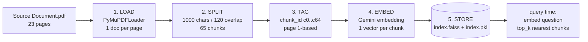
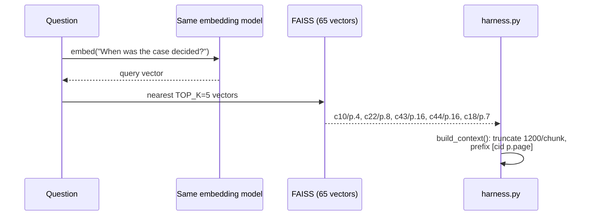

# Indexing in very detail (with examples)

Indexing runs **once** (`build_index.py`) and turns `Source Document.pdf` into a searchable FAISS index. Your PDFs: `Source Document.pdf` = 23 pages → **65 chunks**. Files produced: `index/faiss_source/index.faiss` (vectors) + `index.faiss/index.pkl` (texts + metadata).

## Big picture



## Step 1 — LOAD (PDF → one document per page)

`PyMuPDFLoader("data/pdfs/Source Document.pdf").load()` extracts text per page.

Example — real page 1 of your PDF:

```text
page0 chars: 1920
"[2026] 1 S.C.R. 1 : 2026 INSC 5
Motilal Oswal Financial Services Limited
v.
Santosh Cordeiro and Another
(Civil Appeal No. 36 of 2026)
05 January 2026 ..."
```

Each page becomes a `Document(page_content="...", metadata={"page": 0, "source": "Source Document.pdf"})`. Note `page` is **0-based** here (first page = 0); step 3 fixes it to 1-based for human citations.

## Step 2 — SPLIT (pages → overlapping chunks)

Splitter config (`build_index.py:53-57`):

```python
RecursiveCharacterTextSplitter(
    chunk_size=1000, chunk_overlap=120,
    separators=["\n\n", "\n", ". ", " ", ""],
)
```

What it does, in order: try to cut at blank lines first (`\n\n` = paragraphs), else single newlines, else sentence ends (`. `), else spaces, else anywhere. This keeps legal paragraphs and sentences whole instead of slicing mid-word.

Why 1000 / 120: ~1000 chars ≈ 250 tokens — small enough that `TOP_K=3` chunks fit in ~750–1000 prompt tokens (token-saver), large enough to hold one full argument. Overlap 120 chars (~30 tokens) repeats the boundary so a fact split across two chunks survives in at least one of them.

Real example from your index — chunk `c0` tail vs chunk `c1` head:

```text
c0 tail: "...1882 Act before \nthe arbitrator and filed a s.16 application under the A&C Act"
c1 head: "the arbitrator and filed a s.16 application under the A&C Act \nbefore the arbitr..."
```

The ~120-char repeat (`the arbitrator and filed a s.16 application...`) is the overlap. Without it, a question about the s.16 application could land on a chunk missing half the sentence.

Sizes from your run: `c0 = 968 chars`, `c1 = 931 chars`, middle `c32 = 956 chars`, last `c64 = 677 chars` (short tail chunk — normal).

## Step 3 — TAG (metadata for citations)

```python
c.metadata["chunk_id"] = f"c{i}"   # c0, c1, ... c64
c.metadata["page"] = int(c.metadata["page"]) + 1   # 0-based -> 1-based
```

Result per chunk:

| field | example | used for |
|---|---|---|
| `chunk_id` | `c10` | citation key `[c10 p.4]` |
| `page` | `4` | citation page, highlight lookup |
| `source` | `Source Document.pdf` | provenance |
| `page_content` | `"dated 02.05.2024 passed by the Single Judge..."` (≤1000 chars) | embedded + shown to LLM |

## Step 4 — EMBED (text → meaning-vectors)

`GoogleGenerativeAIEmbeddings(model=GEMINI_EMBED_MODEL)` (your `.env`: `gemini-embedding-2`) sends each chunk to Gemini and gets back a vector — a long number list where similar meanings sit close together.

Mental model (simplified to 3 numbers):

```text
c10 "Bombay High Court order dated 02.05.2024..."  -> [0.81, 0.12, 0.44]
c43 "security deposit should be repaid..."          -> [0.10, 0.88, 0.31]
question "When was the case decided?"              -> [0.79, 0.15, 0.40]  ≈ near c10
```

The question vector lands near date/order chunks, far from deposit chunks — so retrieval is by **meaning**, not keyword matching. Critical rule: the **same embedding model** must be used at index time and query time (`harness.py` reads the same `.env` key). Change the model → rebuild the index.

## Step 5 — STORE (FAISS files)

```python
db = FAISS.from_documents(chunks, emb)
db.save_local("index/faiss_source/")
```

Produces:

* `index.faiss` (~799 KB) — the vector index for fast nearest-neighbour search.
* `index.pkl` (~64 KB) — the chunk texts + metadata (`chunk_id`, `page`).

No LLM call happens here — only embedding calls (65 for your PDF). Re-run `build_index.py` when: the source PDF changes, `CHUNK_SIZE`/`OVERLAP` change, or `GEMINI_EMBED_MODEL` changes.

## Step 6 — How the index is used at query time



Concrete: your trace for `"What the case is about explain in detail"` retrieved 5 docs (`c10, c22, c43, c44, c18`), context = 4634 chars, prompt = 5039 chars. Those `[c10 p.4]` prefixes are what force the cited answer style.

## Mini end-to-end example

Source sentence on page 4: `"order dated 02.05.2024 passed by the Single Judge of the High Court of Judicature at Bombay"`.

1. Lives in chunk `c10` (page tagged `4`).
2. Embedded → vector V10 stored in `index.faiss`, text in `index.pkl`.
3. Question `"When was the case decided?"` → vector near V10 → `c10` in top_k.
4. Context line sent to LLM: `[c10 p.4] dated 02.05.2024 passed by the Single Judge...`.
5. Answer sentence: `"...order dated 02.05.2024... [c10 p.4]."` + highlight probe searches that text in `Final Document.pdf`.
